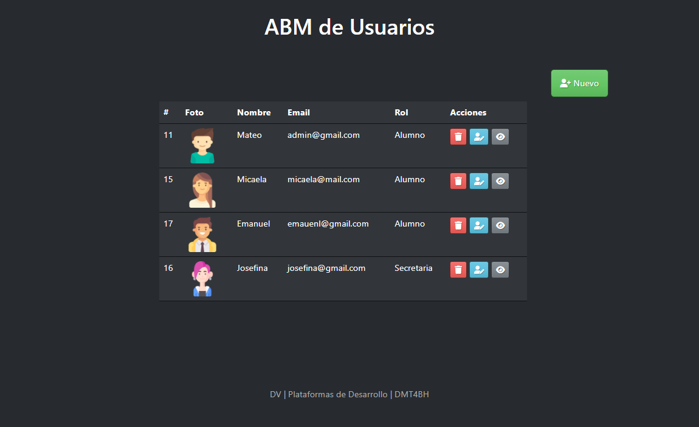

# ABM Básico con PHP y MySQL

## 📘 Material de apoyo para la materia **Plataforma de Desarrollo**

- Lectura de datos de la base de datos
- Guardado de datos
- Actualización de datos
- Subir imágenes
- Eliminar datos

*Nota: Ejemplo básico, se puede mejorar*
